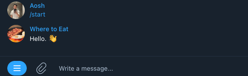

# Where to Eat Bot
## where_2_eat
This bot helps you decide where to eat based on a couple of questions and a predefined list of restaurants. This bot won't be useful to most people as the underlying data is quite localised but the code is here for others to copy.

The where_2_eat bot is available here: [t.me/where_2_eat_bot](https://t.me/where_2_eat_bot). Here's an example of the simple functionality.

## Motivation
Far too often, I am undecided on where to have a quick meal. Most of the time I end up going to the same takeaway store. I wanted to code up an app that decides for you based on a couple of questions. I took inspiration from a 'where should you travel' app (which I can't find the link to now). 

Throughout this project, I practiced:
- reading API documentation
- connecting to APIs
- how to deploy an app on Heroku
- logging info
- creating a telegram bot
- using async functions
- basics of webhooks

## Future improvements
- A lot of the code is hardcoded, for example, the button layouts. See [here](https://github.com/python-telegram-bot/v13.x-wiki/wiki/Code-snippets#build-a-menu-with-buttons) to make buttons dynamic.
- Food data in `/data/food.csv`. The current copy is a small list I put together just for getting a working copy of the code. This dataset can be extended with webscraping and a better set of characteristics/questions.